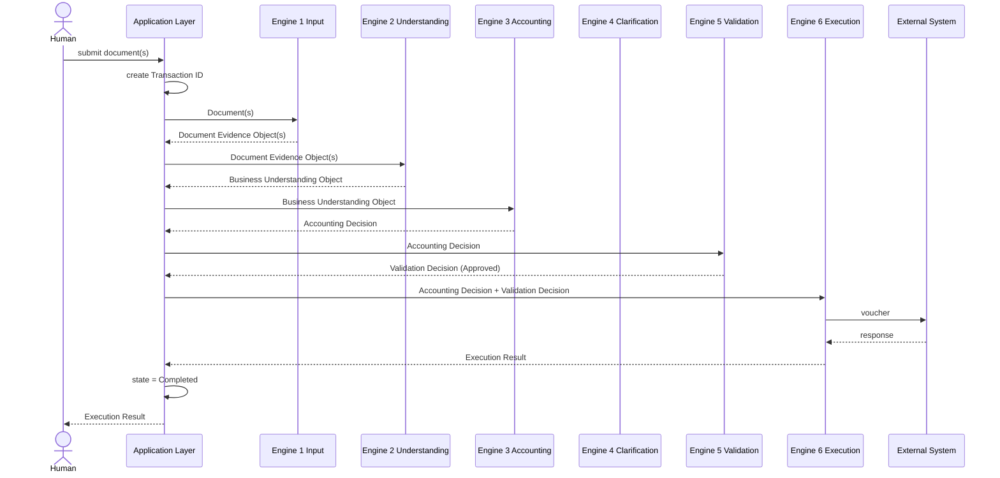
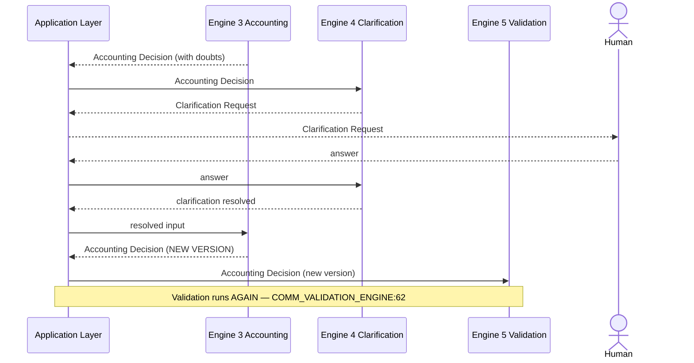
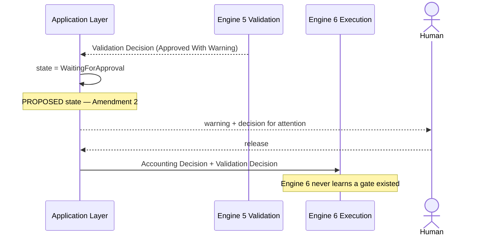
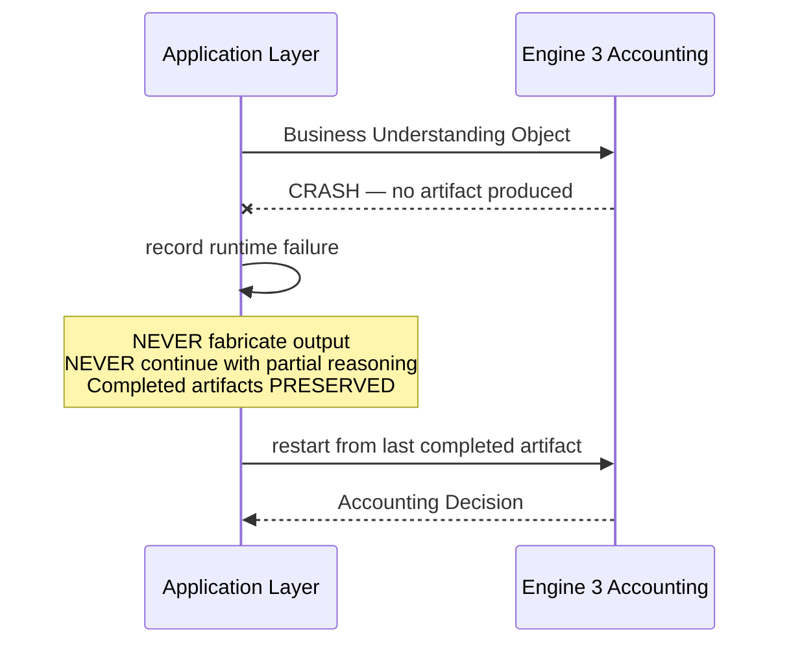
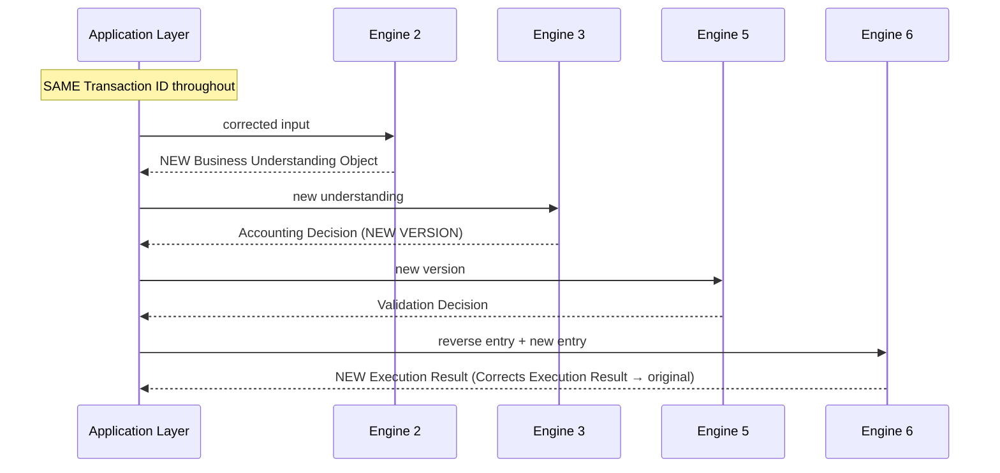
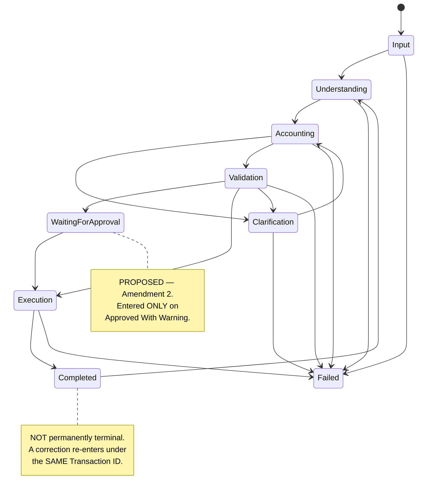
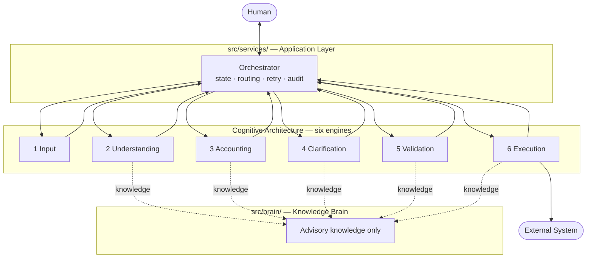

# The Application Layer

> **Precedence level 3 — Engine Specifications.** Written under the frozen architecture.
> **If this and a locked document conflict, the locked document wins.** Report it; never resolve silently.
>
> Lives in [`src/services/`](../src/services/) — fixed by [`SYSTEM_INVARIANTS.md` INV-4](SYSTEM_INVARIANTS.md).
>
> ⚠️ **Depends on Amendment 2** (`WaitingForApproval`), which is **PROPOSED, NOT APPROVED** — see [`ARCHITECTURE_AMENDMENTS.md`](ARCHITECTURE_AMENDMENTS.md). Every occurrence is marked. Until approval, the locked state machine is the one in `DATA_FLOW.md` §14.

---

## 1. Mission

**Coordinate execution between the six engines. Own workflow. Own no reasoning.**

The Application Layer is not an engine and never becomes one. It is the only component permitted to start an engine, move an artifact between engines, or change a transaction's state.

> **Engines are reasoning stages. They never own workflow. Workflow never becomes another engine.** — INV-4

---

## 2. What it owns, and what it never owns

Copied verbatim from INV-4. **Not extended, not reinterpreted.**

| The Application Layer owns | It never owns |
|---|---|
| Creating the Transaction ID | Any decision |
| Starting engines | Any artifact |
| Routing artifacts | Any confidence |
| Lifecycle | Any reasoning |
| Retrying engine execution | Any authority-table row |
| Coordinating state transitions | |
| Deciding a transaction is complete | |

### The distinction that matters

```text
✓  Application Layer:  "Engine 3 crashed. Restart it from the last completed artifact."
✓  Application Layer:  "Validation returned Approved With Warning. Hold until a human releases."

✗  Application Layer:  "This looks like an asset, send it to Engine 3 with that hint."
✗  Application Layer:  "Confidence is low, so re-run Understanding."
```

The second pair are reasoning wearing workflow's clothing. **The Application Layer may decide *whether work moves*. It may never decide *what the work concludes*.**

It reads artifacts only to route them. It never reads them to form an opinion about their content.

---

## 3. Relationship to the Brain

**None.** They never interact.

| | Brain (`src/brain/`) | Application Layer (`src/services/`) |
|---|---|---|
| Provides | Knowledge | Workflow |
| Called by | Engines | Nothing — it calls |
| Owns decisions | Never | Never |
| Owns workflow | **Never** | **Always** |
| Owns state | Never | Always |

The Brain answers questions engines ask. The Application Layer moves work between engines. **The Application Layer never queries the Brain, and the Brain never observes workflow.** Neither can substitute for the other.

---

## 4. Request lifecycle



**Every arrow passes through the Application Layer.** No engine appears on both ends of an arrow with another engine.

### Clarification loop



### `Approved With Warning` hold — ⚠️ requires Amendment 2



### Engine crash



### Correction



---

## 5. Transaction state machine

⚠️ **`WaitingForApproval` is PROPOSED — Amendment 2, not approved.**



### Every state, defined

| State | Entry condition | Exit condition | Allowed transitions | Forbidden transitions |
|---|---|---|---|---|
| **Input** | Transaction ID created; document(s) received | Engine 1 produces every Document Evidence Object | → Understanding · → Failed | → any later stage. **No skipping** (`DATA_FLOW:283`) |
| **Understanding** | Every Document Evidence Object present | Engine 2 produces the Business Understanding Object | → Accounting · → Failed | → Validation · → Execution |
| **Accounting** | Business Understanding Object present | Engine 3 produces an Accounting Decision | → Clarification · → Validation · → Failed | → Execution. Never reaches Engine 6 without Validation |
| **Clarification** | Engine 3 or Engine 5 raised a blocking doubt | Clarification resolved or abandoned by a human | → Accounting (new decision version) · → Failed | → Validation directly · → Execution. Engine 3 **must** re-decide first |
| **Validation** | Accounting Decision present | Engine 5 produces a Validation Decision | → Execution (`Approved`) · → WaitingForApproval (`Approved With Warning`) · → Clarification (`Clarification Required`) · → Failed (`Rejected`) | → Execution on anything except `Approved` or a released `Approved With Warning` |
| **WaitingForApproval** ⚠️ | Validation Decision is **`Approved With Warning`** and nothing else | A human calls `release_waiting_for_approval()` | → Execution | → Completed · → Clarification · back to Validation. **No engine may enter, leave or observe this state** |
| **Execution** | `Approved`, or `Approved With Warning` **after release** | Engine 6 produces an Execution Result | → Completed · → Failed | **→ any earlier state. Execution has no backward arrow** (`DATA_FLOW:285`) |
| **Completed** | Execution Result produced and recorded | A correction arrives | → Understanding (correction, same Transaction ID) | → Execution directly. A correction is a **new decision version**, never a re-post |
| **Failed** | Any stage recorded a runtime failure that exhausted retries | An operator restarts from the last completed artifact | → the state that failed | → forward. **Never fabricate output to escape Failed** |

### Rules that hold in every state

```text
Exactly one state per Transaction ID, at any moment.        INV-4
Transitions are ATOMIC.                                     INV-4
Parallel transactions ALLOWED.                              INV-4
Parallel states for ONE transaction PROHIBITED.             INV-4
Completed is NOT permanently terminal.                      DATA_FLOW §14
```

### Distinct from Clarification Status

Transaction state is **workflow** and belongs here. Clarification Status is **an artifact's lifecycle** and belongs to Engine 4. They are never merged and never inferred from one another.

---

## 6. Engine sequencing

| Step | Application Layer calls | Passing | Receives | On failure |
|---|---|---|---|---|
| 1 | Engine 1 — Input | raw document(s) + Transaction ID | Document Evidence Object per document | retry per policy → `Failed` |
| 2 | Engine 2 — Understanding | every Document Evidence Object sharing the Transaction ID | Business Understanding Object | retry → `Failed` |
| 3 | Engine 3 — Accounting | Business Understanding Object | Accounting Decision | retry → `Failed` |
| 4 | Engine 4 — Clarification *(only if a blocking doubt exists)* | Accounting Decision | Clarification Request; then a human answer | retry → `Failed` |
| 5 | Engine 5 — Validation | Accounting Decision | Validation Decision | retry → `Failed` |
| 6 | Engine 6 — Execution | Accounting Decision + Validation Decision | Execution Result | **never retried by the Application Layer as a re-post** — see §8 |

**Many documents, one transaction.** Several Document Evidence Objects may share one Transaction ID and contribute to one Business Understanding Object. The Understanding Engine owns that aggregation; the Application Layer only ensures every one is present before step 2 begins.

---

## 7. Error architecture

### Runtime versus business failure

> **Business failures belong to sub-engines. Runtime failures belong to the Application Layer.** — INV-4

| | Business failure | Runtime failure |
|---|---|---|
| Example | *"The vendor name matches two ledgers"* | *"Engine 3 process died"* |
| Produces | An **artifact** recording the doubt | **Nothing.** Engine failure is not an artifact |
| Owned by | The sub-engine | The Application Layer |
| Response | Continue the pipeline; the doubt travels | Preserve, record, restart from the last completed artifact |
| Retried? | **Never** — it is a valid conclusion, not an error | Per retry policy |

**Confusing these is the failure this section exists to prevent.** Retrying a business failure would re-run reasoning that already succeeded, and could produce a *different* conclusion from identical input — destroying reproducibility.

### Taxonomy

| Class | Owner | Retryable | Example |
|---|---|---|---|
| **Invalid input** | Engine 1 | No | Zero-byte file. Produces a Document Evidence Object recording the failure |
| **Missing evidence** | Engine 2/3 | No | A required fact is absent. Travels as a doubt |
| **Engine timeout** | Application Layer | **Yes** | Engine exceeded its configured timeout |
| **Engine crash** | Application Layer | **Yes** | Process died; no artifact produced |
| **Schema violation** | Application Layer | **No** | An engine returned an artifact failing its contract. A defect, not a transient fault |
| **Rule conflict** | Engine 5 | No | Two validators disagree. Produces a Validation Decision |
| **Confidence below threshold** | Engine 3/4 | No | A business conclusion. Produces a Clarification Request |
| **Transport failure to external system** | **Engine 6** | Engine 6's own retry | Tally unreachable. `posting_manager` reposts; the Application Layer does not |
| **Unexpected exception** | Application Layer | **Yes**, then `Failed` | Anything unclassified. **Never swallowed** |

### The split that must not blur

```text
Engine 6 reposts a transport-failed voucher.      ← FDI:80
The Application Layer restarts a crashed engine.  ← FDI:80

posting_manager never restarts a workflow.
The Application Layer never decides a voucher should be sent again.  ← COMM_EXECUTION_INTERNAL:131
```

---

## 8. Retry policy

**The Application Layer retries engine *execution*. It never retries a *decision*.**

| Rule | |
|---|---|
| Retryable | Engine timeout · engine crash · unexpected exception |
| Not retryable | Any business failure · any schema violation · any Engine 6 transport failure |
| Restart point | **The last completed artifact.** Never mid-engine, never from a partial artifact |
| On exhaustion | State → `Failed`. Completed artifacts preserved. Nothing fabricated |
| Engine 6 | **Excluded from Application Layer retry.** Re-posting is `posting_manager`'s, bounded by the idempotency key: Decision ID + Decision Version + Destination System |

### Configuration — no defaults, by design

Retry limits and timeouts are **not specified here**. They are required configuration with **no default value**.

```text
APP_RETRY_MAX_ATTEMPTS_PER_ENGINE    integer          REQUIRED, no default
APP_ENGINE_TIMEOUT_SECONDS           per engine       REQUIRED, no default
APP_RETRY_BACKOFF                    strategy         REQUIRED, no default
```

**A missing required value is a startup failure, never a silent default.** A default retry count is a number nobody chose, silently governing how many times a financial operation is attempted.

---

## 9. Observability

The **Transaction ID is the correlation ID.** It already exists, is created here, and is carried by every artifact — nothing new is invented to trace a request.

| Signal | Content |
|---|---|
| **Trace** | Every state transition: from · to · Transaction ID · timestamp · trigger |
| **Log** | Engine started · engine returned · artifact received · retry attempted · state changed · failure recorded |
| **Metric** | Transactions per state · time in state · retry count per engine · failure count by class |
| **Audit trail** | Every transition, append-only, immutable. Answers *"why is this transaction where it is"* without inference |

**Logging points are workflow events only.** The Application Layer never logs the *content* of a decision — that belongs to the artifact and to the engine that owns it.

**No secret, credential or document content is ever logged.**

---

## 10. Configuration

**Nothing hardcoded.** Every value below is required at startup; a missing one is a hard failure.

| Key | Type | Default |
|---|---|---|
| `APP_RETRY_MAX_ATTEMPTS_PER_ENGINE` | integer | **none — REQUIRED** |
| `APP_ENGINE_TIMEOUT_SECONDS` | per engine | **none — REQUIRED** |
| `APP_RETRY_BACKOFF` | strategy | **none — REQUIRED** |
| `APP_ENGINE_ENDPOINTS` | per engine | **none — REQUIRED** |
| `APP_STATE_STORE` | connection | **none — REQUIRED** |
| `APP_AUDIT_SINK` | connection | **none — REQUIRED** |

Secrets are supplied by environment, never by file, never in code — `CLAUDE.md` Law 22.

---

## 11. Extension architecture

A new engine, validator or output destination must plug in **without modifying any existing engine.**

| Extension | How | What must NOT happen |
|---|---|---|
| **New engine** | Registered with its position, input artifact and output artifact. The Application Layer routes to it | No existing engine learns of it. No engine calls it directly |
| **New validator** | Added **inside Engine 5**, not here. The Application Layer sees one Validation Decision regardless of validator count | The Application Layer never learns how many validators exist |
| **New reasoning module** | Belongs inside the engine that owns that reasoning | Never added to the Application Layer. Reasoning here would violate INV-4 |
| **New output destination** | Added inside Engine 6. The idempotency key already includes Destination System | The Application Layer never learns destination semantics |

**The extension rule:** if a change requires the Application Layer to understand *what* an artifact means, it is being extended in the wrong place.

---

## 12. What the Application Layer must never do

```text
Make an accounting decision                          any engine's job
Create, modify or version an artifact                the owning engine's job
Hold or compute confidence                           Engines 1–4
Read an artifact to form an opinion on its content   reasoning, not workflow
Query the Brain                                      engines query the Brain
Skip a stage                                         DATA_FLOW:283
Send work backwards from Execution                   DATA_FLOW:285
Fabricate output when an engine fails                INV-4
Continue with partial reasoning                      INV-4
Produce a partial artifact                           INV-4
Re-post a voucher                                    posting_manager's job
Invent a state                                       your ruling, see §5
```

> **If a state is not in the locked state machine, it does not exist.**
> Quoted from your ruling and enforced by `ARCHITECTURE_AUDIT.md`.

---

## 13. Component diagram



**Read the arrows carefully:**

- Every engine arrow is **bidirectional with the Application Layer only**. No engine touches another engine.
- Brain arrows are **dotted and one-directional** — engines ask, the Brain answers. It initiates nothing.
- **There is no arrow between the Application Layer and the Brain.** They never interact.
- Only Engine 6 reaches the external system.

---

## 14. Where it is built

| Component | Phase | Why |
|---|---|---|
| Brain interface contract | **P2** | *"The Brain never returns a decision"* is a pure predicate — no AI, no ground truth, no cost. It belongs with conformance |
| **Application Layer** | **P3** | P3 proves the pipeline. A pipeline **is** orchestration; nothing can be sequenced before the sequencer. Has no AI, so it is fully buildable at P3 |
| Brain stub | **P3** | Proves the seam without faking knowledge |
| Brain real knowledge | **P4** | Only what the one vertical-slice document needs |
| Brain widened | **P5** | Widens with the golden set |

Full dependency table and forward-dependency proof: [`MVP_IMPLEMENTATION_BLUEPRINT.md`](MVP_IMPLEMENTATION_BLUEPRINT.md) §2.
